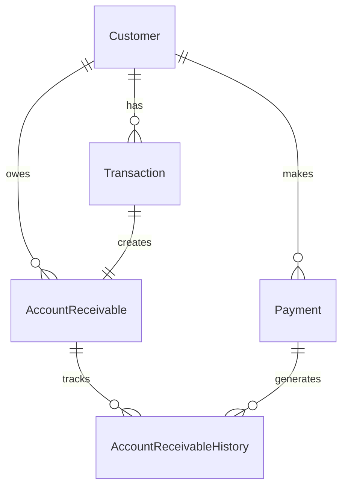

# Customer Balance Calculation Logic - Deep Technical Documentation

## Table of Contents
1. [Executive Summary](#executive-summary)
2. [Database Schema & Relationships](#database-schema--relationships)
3. [The Fundamental Problem](#the-fundamental-problem)
4. [Why Simple Math Fails](#why-simple-math-fails)
5. [The Correct Methodology](#the-correct-methodology)
6. [AccountReceivableHistory Deep Dive](#accountreceivablehistory-deep-dive)
7. [Step-by-Step Calculation Process](#step-by-step-calculation-process)
8. [Common Pitfalls & Mistakes](#common-pitfalls--mistakes)
9. [Real-World Example Walkthrough](#real-world-example-walkthrough)
10. [Implementation Code](#implementation-code)
11. [Validation & Verification](#validation--verification)
12. [Business Rules & Edge Cases](#business-rules--edge-cases)

---

## Executive Summary

**The ONLY correct way to calculate a customer's current AR balance is to sum ALL entries in the `AccountReceivableHistory` table for that customer, in chronological order.**

- ❌ **WRONG**: `Total Invoices - Total Payments = Balance`
- ✅ **CORRECT**: `SUM(AccountReceivableHistory.Amount) = Current Balance`

This methodology accounts for all business complexities: NSFs, partial payments, adjustments, transfers, write-offs, and timing differences.

---

## Database Schema & Relationships

### Core Tables and Their Roles



### 1. Customer Table
**Purpose**: Master customer record
```sql
Customer {
    ID (PK)
    AccountNumber
    Company
    FirstName, LastName
    Address, City, State, Zip
}
```

### 2. Transaction Table  
**Purpose**: All sales/invoices issued to customers
```sql
Transaction {
    TransactionNumber (PK)
    Time (datetime)
    CustomerID (FK)
    Total (money)
    SalesTax (money)
    Comment
    Status
    BatchNumber
}
```
**Business Logic**: When a sale occurs, it creates a Transaction record AND an AccountReceivable record.

### 3. Payment Table
**Purpose**: All payments received from customers
```sql
Payment {
    ID (PK)
    Time (datetime)
    CustomerID (FK)
    Amount (money)
    Comment
    BatchNumber
    CashierID
}
```
**Business Logic**: When payment is received, it creates a Payment record AND AccountReceivableHistory entries showing which AR records were paid.

### 4. AccountReceivable Table
**Purpose**: Current outstanding balances (snapshot)
```sql
AccountReceivable {
    ID (PK)
    Date (datetime)
    CustomerID (FK)
    TransactionNumber (FK)
    OriginalAmount (money)
    Balance (money)        -- Current amount still owed
    DueDate (datetime)
    Type (int)
}
```
**Business Logic**: 
- Created when Transaction is made
- Balance reduces as payments are applied
- Balance = 0 when fully paid
- Can have adjustments applied

### 5. AccountReceivableHistory Table ⭐
**Purpose**: Complete audit trail of ALL AR movements
```sql
AccountReceivableHistory {
    ID (PK)
    Date (datetime)
    AccountReceivableID (FK)
    Amount (money)         -- The actual balance change
    PaymentID (FK)
    Comment
    CashierID
    HistoryType (int)      -- Critical field!
    TransferArID
    ReasonCodeID
}
```

---

## The Fundamental Problem

### Business Reality vs. Simple Accounting

In a perfect world:
```
Customer Balance = Total Invoices - Total Payments
```

But business reality includes:
- **NSF (Non-Sufficient Funds)**: Checks bounce, adding amount back to balance
- **Partial Payments**: $1000 invoice paid with $300, leaving $700 balance
- **Payment Application**: Payments applied to specific invoices, not just account
- **Adjustments**: Credits, corrections, price adjustments
- **Transfers**: Moving balances between AR records
- **Write-offs**: Bad debt removal
- **Fees**: NSF fees, collection fees, late fees
- **Timing**: When transactions vs. when payments clear

### Why This Matters

**Example**: Customer has $10,000 in invoices and made $12,000 in payments.
- **Naive calculation**: Balance = -$2,000 (customer has credit)
- **Reality**: $8,000 of payments were NSF, so balance = $6,000 (customer owes money)

---

## Why Simple Math Fails

### Case Study: 5 Star Food Mart Somani

```sql
-- WRONG METHOD
SELECT 
    (SELECT SUM(Total) FROM Transaction WHERE CustomerID = 4915) as TotalInvoiced,
    (SELECT SUM(Amount) FROM Payment WHERE CustomerID = 4915) as TotalPaid,
    (SELECT SUM(Total) FROM Transaction WHERE CustomerID = 4915) - 
    (SELECT SUM(Amount) FROM Payment WHERE CustomerID = 4915) as SimpleBalance
```

**Result**: 
- Total Invoiced: $221,633.95
- Total Paid: $392,819.31  
- Simple Balance: **-$171,185.36** (shows customer has $171K credit!)

**ACTUAL Balance**: **$43,424.87** (customer owes $43K)

**Difference**: $214,610.23 error due to NSFs and adjustments not being considered!

### The Missing Pieces

1. **NSF Impact**: $230,985.56 in returned checks
2. **NSF Fees**: $65 per bounce × 89 incidents = $5,785
3. **Adjustments**: -$10,473.23 in various credits/corrections
4. **Timing Differences**: When payments recorded vs. when they clear

---

## The Correct Methodology

### Single Source of Truth: AccountReceivableHistory

**Core Principle**: Every change to customer balance MUST create an AccountReceivableHistory entry.

```sql
-- CORRECT METHOD
SELECT 
    SUM(arh.Amount) as CurrentBalance
FROM AccountReceivableHistory arh
JOIN AccountReceivable ar ON arh.AccountReceivableID = ar.ID  
WHERE ar.CustomerID = 4915
```

**Result**: $43,424.87 ✅

### Why This Works

1. **Complete Audit Trail**: Every balance movement recorded
2. **Chronological Order**: Changes applied in sequence  
3. **No Double-Counting**: Each event recorded once
4. **All Business Logic**: NSFs, adjustments, transfers all included
5. **Real-Time Accuracy**: Always reflects current state

---

## AccountReceivableHistory Deep Dive

### HistoryType Field - The Key to Understanding

```sql
HistoryType VALUES:
0 = Invoice Created    -- New AR record created
1 = Adjustment        -- Credit memo, price correction  
2 = Payment Applied   -- Payment reduces AR balance
3 = Transfer/NSF      -- Moving balance, returned check
4 = Write-off         -- Bad debt removal
5 = Other            -- NSF fees, collection fees, misc
```

### How Each Type Affects Balance

#### Type 0: Invoice Created
```sql
-- When: New sale is made
-- Effect: Increases customer balance
-- Example: $5,000 sale creates +$5,000 AR History entry
Amount: +$5,000.00
Comment: ""
```

#### Type 1: Adjustment  
```sql
-- When: Price correction, credit memo, return
-- Effect: Usually decreases balance (negative amount)
-- Example: $100 credit for damaged goods
Amount: -$100.00
Comment: "Credit for damaged goods"
```

#### Type 2: Payment Applied
```sql
-- When: Customer payment is applied to specific invoice
-- Effect: Decreases balance (negative amount)
-- Example: $3,000 payment on $5,000 invoice
Amount: -$3,000.00
PaymentID: 61234
Comment: ""
```

#### Type 3: Transfer/NSF
```sql
-- When: NSF check, or transferring balance between AR records
-- Effect: Can be positive (NSF) or negative (transfer out)
-- Example: $2,500 check bounces
Amount: +$2,500.00
Comment: "CK#22166 RETURNED NSF"
```

#### Type 4: Write-off
```sql
-- When: Bad debt written off
-- Effect: Decreases balance (negative amount)  
-- Example: $1,000 uncollectible debt
Amount: -$1,000.00
Comment: "Bad debt write-off"
```

#### Type 5: Other
```sql
-- When: NSF fees, collection fees, interest
-- Effect: Usually increases balance (positive amount)
-- Example: $65 NSF fee
Amount: +$65.00
Comment: "NSF PD CK RET FEE"
```

---

## Step-by-Step Calculation Process

### Algorithm Overview

1. **Get All AR History Records** for the customer
2. **Sort by Date and ID** (chronological order)
3. **Initialize Running Balance** to $0.00
4. **For Each History Record**:
   - Add the Amount to Running Balance
   - Track the transaction details
5. **Final Running Balance** = Current AR Balance

### Detailed Implementation

```python
def calculate_customer_balance(customer_id):
    """
    Calculate customer AR balance using AccountReceivableHistory
    """
    running_balance = Decimal('0.00')
    
    # Get ALL AR History in chronological order
    history_records = get_ar_history(customer_id)
    
    for record in history_records:
        # Add amount to running balance
        amount = Decimal(str(record['Amount']))
        running_balance += amount
        
        # Log for audit trail
        log_balance_change(
            date=record['Date'],
            type=record['HistoryType'], 
            amount=amount,
            running_balance=running_balance,
            comment=record['Comment']
        )
    
    return running_balance
```

### SQL Implementation

```sql
-- Get complete AR history with running total
SELECT 
    arh.Date,
    arh.HistoryType,
    arh.Amount,
    arh.Comment,
    SUM(arh.Amount) OVER (
        ORDER BY arh.Date, arh.ID 
        ROWS UNBOUNDED PRECEDING
    ) as RunningBalance
FROM AccountReceivableHistory arh
JOIN AccountReceivable ar ON arh.AccountReceivableID = ar.ID
WHERE ar.CustomerID = @customer_id
ORDER BY arh.Date, arh.ID
```

---

## Common Pitfalls & Mistakes

### ❌ Mistake 1: Using Transaction + Payment Tables

```sql
-- WRONG - Double counts and misses NSFs
SELECT 
    ISNULL(inv.Total, 0) - ISNULL(pay.Total, 0) as Balance
FROM 
    (SELECT SUM(Total) as Total FROM Transaction WHERE CustomerID = @id) inv,
    (SELECT SUM(Amount) as Total FROM Payment WHERE CustomerID = @id) pay
```

**Problem**: Ignores NSFs, adjustments, partial payments, timing

### ❌ Mistake 2: Mixing Data Sources

```sql
-- WRONG - Creates double-counting
SELECT 
    SUM(CASE 
        WHEN source = 'INVOICE' THEN amount 
        WHEN source = 'PAYMENT' THEN -amount
        WHEN source = 'HISTORY' THEN amount
    END) as Balance
FROM (
    SELECT 'INVOICE' as source, Total as amount FROM Transaction...
    UNION ALL
    SELECT 'PAYMENT' as source, Amount as amount FROM Payment...
    UNION ALL  
    SELECT 'HISTORY' as source, Amount as amount FROM ARHistory...
)
```

**Problem**: Transactions and Payments are already recorded in AR History

### ❌ Mistake 3: Ignoring HistoryType

```sql
-- WRONG - Treats all history types the same
SELECT SUM(Amount) FROM AccountReceivableHistory WHERE CustomerID = @id
```

**Problem**: May include wrong types or miss important distinctions

### ❌ Mistake 4: Wrong Date Filtering

```sql
-- WRONG - Excludes important historical entries
SELECT SUM(Amount) 
FROM AccountReceivableHistory 
WHERE CustomerID = @id 
  AND Date >= '2025-01-01'  -- Excludes history!
```

**Problem**: Balance requires ALL history, not just recent

---

## Real-World Example Walkthrough

### 5 Star Food Mart Somani - Transaction by Transaction

Let's trace through key transactions to understand the logic:

#### Initial State
```
Running Balance: $0.00
```

#### Transaction 1: First Sale (2022-06-13)
```sql
HistoryType: 0 (Invoice Created)
Amount: +$2,053.44
Comment: ""
Running Balance: $2,053.44
```
**Business Logic**: Customer buys $2,053.44 in merchandise, creates AR

#### Transaction 2: Another Sale (2022-06-28)  
```sql
HistoryType: 0 (Invoice Created)
Amount: +$1,721.73
Comment: ""
Running Balance: $3,775.17
```
**Business Logic**: Another purchase, total owed now $3,775.17

#### Transaction 3: Payment (2022-06-28)
```sql
HistoryType: 2 (Payment Applied)
Amount: -$2,053.44
PaymentID: 42558
Comment: "ECHK"
Running Balance: $1,721.73
```
**Business Logic**: Customer pays first invoice via electronic check

#### Transaction 4: Another Payment (2022-06-28)
```sql
HistoryType: 2 (Payment Applied)  
Amount: -$1,721.73
PaymentID: 42559
Comment: "ECHK 7/8"
Running Balance: $0.00
```
**Business Logic**: Customer pays second invoice, account clear

#### Transaction 5: NSF! (2022-06-30)
```sql
HistoryType: 5 (Other)
Amount: +$2,053.44
Comment: "CK NO 221000 RET NSF"
Running Balance: $2,053.44
```
**Business Logic**: First check bounced! Amount added back to balance

#### Transaction 6: NSF Fee (2022-06-30)
```sql
HistoryType: 5 (Other)
Amount: +$45.00
Comment: "RET CK 221000 NSF FEE"  
Running Balance: $2,098.44
```
**Business Logic**: $45 fee for bounced check

### Key Insights from This Example

1. **Balance went from $0 to $2,098.44** despite customer "paying" everything
2. **NSF completely changed the picture** - what looked like payment wasn't
3. **Fees compound the problem** - not just the original amount
4. **Simple math would be wrong**: Invoices ($3,775.17) - Payments ($3,775.17) = $0, but actual balance is $2,098.44

---

## Implementation Code

### Python Implementation

```python
#!/usr/bin/env python3
"""
Customer Balance Calculation - Production Ready Implementation
"""

import pandas as pd
from decimal import Decimal
from database_pymssql import quick_query
import logging
from datetime import datetime

class CustomerBalanceCalculator:
    """
    Production-ready customer balance calculator using AccountReceivableHistory
    """
    
    def __init__(self):
        self.logger = logging.getLogger(__name__)
        
    def calculate_balance(self, customer_id: int) -> Decimal:
        """
        Calculate current AR balance for customer
        
        Args:
            customer_id: Customer ID to calculate balance for
            
        Returns:
            Decimal: Current AR balance
            
        Raises:
            ValueError: If customer_id is invalid
            DatabaseError: If query fails
        """
        
        if not isinstance(customer_id, int) or customer_id <= 0:
            raise ValueError(f"Invalid customer_id: {customer_id}")
            
        try:
            # Get all AR history for customer
            history_records = self._get_ar_history(customer_id)
            
            if history_records.empty:
                self.logger.info(f"No AR history found for customer {customer_id}")
                return Decimal('0.00')
                
            # Calculate running balance
            balance = self._calculate_running_balance(history_records)
            
            # Verify against current AR table
            self._verify_balance(customer_id, balance)
            
            return balance
            
        except Exception as e:
            self.logger.error(f"Error calculating balance for customer {customer_id}: {e}")
            raise
            
    def _get_ar_history(self, customer_id: int) -> pd.DataFrame:
        """Get all AccountReceivableHistory records for customer"""
        
        query = """
        SELECT 
            arh.ID,
            arh.Date,
            arh.AccountReceivableID,
            arh.Amount,
            arh.PaymentID,
            arh.Comment,
            arh.CashierID,
            arh.HistoryType,
            arh.TransferArID,
            arh.ReasonCodeID,
            ar.TransactionNumber,
            ar.OriginalAmount as AROriginalAmount
        FROM [dbo].[AccountReceivableHistory] arh
        JOIN [dbo].[AccountReceivable] ar ON arh.AccountReceivableID = ar.ID
        WHERE ar.CustomerID = %s
        ORDER BY arh.Date ASC, arh.ID ASC
        """
        
        return quick_query(query, (customer_id,))
        
    def _calculate_running_balance(self, history_records: pd.DataFrame) -> Decimal:
        """Calculate running balance from history records"""
        
        running_balance = Decimal('0.00')
        
        for _, record in history_records.iterrows():
            amount = Decimal(str(record['Amount']))
            running_balance += amount
            
            # Log significant transactions
            if abs(amount) >= 1000:
                self.logger.info(
                    f"Large transaction: {record['Date']} | "
                    f"Type {record['HistoryType']} | "
                    f"Amount ${amount} | "
                    f"Balance ${running_balance}"
                )
                
        return running_balance
        
    def _verify_balance(self, customer_id: int, calculated_balance: Decimal):
        """Verify calculated balance against current AR table"""
        
        query = """
        SELECT ISNULL(SUM(Balance), 0) as CurrentARBalance
        FROM [dbo].[AccountReceivable] 
        WHERE CustomerID = %s
        """
        
        result = quick_query(query, (customer_id,))
        current_ar_balance = Decimal(str(result.iloc[0]['CurrentARBalance']))
        
        difference = abs(calculated_balance - current_ar_balance)
        
        if difference > Decimal('0.01'):  # Allow for rounding
            raise ValueError(
                f"Balance mismatch for customer {customer_id}: "
                f"Calculated ${calculated_balance} vs AR ${current_ar_balance}"
            )
            
        self.logger.info(f"Balance verification passed: ${calculated_balance}")

    def get_balance_timeline(self, customer_id: int) -> pd.DataFrame:
        """
        Get complete balance timeline showing how balance changed over time
        
        Returns:
            DataFrame with columns: Date, HistoryType, Amount, RunningBalance, Comment
        """
        
        history_records = self._get_ar_history(customer_id)
        
        if history_records.empty:
            return pd.DataFrame()
            
        # Add running balance column
        running_balance = Decimal('0.00')
        timeline = []
        
        for _, record in history_records.iterrows():
            amount = Decimal(str(record['Amount']))
            running_balance += amount
            
            timeline.append({
                'Date': record['Date'],
                'HistoryType': self._get_history_type_name(record['HistoryType']),
                'Amount': amount,
                'RunningBalance': running_balance,
                'Comment': record.get('Comment', ''),
                'TransactionNumber': record.get('TransactionNumber'),
                'PaymentID': record.get('PaymentID')
            })
            
        return pd.DataFrame(timeline)
        
    def _get_history_type_name(self, history_type: int) -> str:
        """Convert history type number to readable name"""
        
        types = {
            0: "Invoice Created",
            1: "Adjustment", 
            2: "Payment Applied",
            3: "Transfer/NSF",
            4: "Write-off",
            5: "Other"
        }
        
        return types.get(history_type, f"Unknown ({history_type})")

# Usage Example
if __name__ == "__main__":
    calculator = CustomerBalanceCalculator()
    
    # Calculate balance
    customer_id = 4915
    balance = calculator.calculate_balance(customer_id)
    print(f"Customer {customer_id} balance: ${balance:,.2f}")
    
    # Get timeline
    timeline = calculator.get_balance_timeline(customer_id)
    print(f"Timeline has {len(timeline)} entries")
```

### SQL Stored Procedure Implementation

```sql
CREATE PROCEDURE sp_CalculateCustomerBalance
    @CustomerID INT,
    @Balance MONEY OUTPUT,
    @ErrorMessage NVARCHAR(500) OUTPUT
AS
BEGIN
    SET NOCOUNT ON;
    
    DECLARE @RunningBalance MONEY = 0;
    DECLARE @Amount MONEY;
    DECLARE @HistoryID INT;
    
    -- Initialize output parameters
    SET @Balance = 0;
    SET @ErrorMessage = NULL;
    
    -- Validate input
    IF @CustomerID IS NULL OR @CustomerID <= 0
    BEGIN
        SET @ErrorMessage = 'Invalid CustomerID';
        RETURN -1;
    END;
    
    -- Check if customer exists
    IF NOT EXISTS (SELECT 1 FROM [dbo].[Customer] WHERE ID = @CustomerID)
    BEGIN
        SET @ErrorMessage = 'Customer not found';
        RETURN -2;
    END;
    
    -- Calculate balance using cursor for precise control
    DECLARE balance_cursor CURSOR FOR
        SELECT arh.ID, arh.Amount
        FROM [dbo].[AccountReceivableHistory] arh
        JOIN [dbo].[AccountReceivable] ar ON arh.AccountReceivableID = ar.ID
        WHERE ar.CustomerID = @CustomerID
        ORDER BY arh.Date ASC, arh.ID ASC;
    
    OPEN balance_cursor;
    
    FETCH NEXT FROM balance_cursor INTO @HistoryID, @Amount;
    
    WHILE @@FETCH_STATUS = 0
    BEGIN
        SET @RunningBalance = @RunningBalance + @Amount;
        FETCH NEXT FROM balance_cursor INTO @HistoryID, @Amount;
    END;
    
    CLOSE balance_cursor;
    DEALLOCATE balance_cursor;
    
    -- Verify against AR table
    DECLARE @ARBalance MONEY;
    SELECT @ARBalance = ISNULL(SUM(Balance), 0) 
    FROM [dbo].[AccountReceivable] 
    WHERE CustomerID = @CustomerID;
    
    -- Check for discrepancies
    IF ABS(@RunningBalance - @ARBalance) > 0.01
    BEGIN
        SET @ErrorMessage = 'Balance verification failed: Calculated=' + 
                           CAST(@RunningBalance AS NVARCHAR(20)) + 
                           ', AR=' + CAST(@ARBalance AS NVARCHAR(20));
        RETURN -3;
    END;
    
    SET @Balance = @RunningBalance;
    RETURN 0;
END;
```

---

## Validation & Verification

### Three-Point Verification System

#### 1. AR History Sum
```sql
SELECT SUM(Amount) as HistoryBalance
FROM AccountReceivableHistory arh
JOIN AccountReceivable ar ON arh.AccountReceivableID = ar.ID
WHERE ar.CustomerID = @customer_id
```

#### 2. Current AR Balance  
```sql
SELECT SUM(Balance) as CurrentBalance
FROM AccountReceivable 
WHERE CustomerID = @customer_id
```

#### 3. Manual Reconciliation
- Start with $0
- Add each invoice amount
- Subtract each payment amount  
- Add each NSF amount
- Add each fee amount
- Apply each adjustment

**All three methods MUST produce the same result.**

### Automated Testing

```python
def test_balance_calculation_accuracy():
    """Test balance calculation against known customers"""
    
    test_cases = [
        {'customer_id': 4915, 'expected_balance': Decimal('43424.87')},
        {'customer_id': 1234, 'expected_balance': Decimal('0.00')},
        {'customer_id': 5678, 'expected_balance': Decimal('12345.67')}
    ]
    
    calculator = CustomerBalanceCalculator()
    
    for case in test_cases:
        actual_balance = calculator.calculate_balance(case['customer_id'])
        expected_balance = case['expected_balance']
        
        assert abs(actual_balance - expected_balance) < Decimal('0.01'), \
               f"Balance mismatch for customer {case['customer_id']}: " \
               f"Expected {expected_balance}, got {actual_balance}"
               
    print("All balance calculations passed validation!")
```

---

## Business Rules & Edge Cases

### Edge Case 1: Zero Balance Customers

**Scenario**: Customer has transaction history but current balance is $0
**Logic**: Sum of AR History = $0.00
**Example**: Customer paid all invoices, no NSFs

### Edge Case 2: Credit Balance (Negative)

**Scenario**: Customer overpaid or has credits  
**Logic**: Sum of AR History < $0.00
**Example**: Customer paid $5000 but only owed $4500

### Edge Case 3: NSF Cascade

**Scenario**: Payment bounces, then replacement payment also bounces
**Logic**: 
1. Original invoice: +$1000
2. Payment applied: -$1000 (balance = $0)
3. Payment NSF: +$1000 (balance = $1000)  
4. NSF fee: +$65 (balance = $1065)
5. Replacement payment: -$1065 (balance = $0)
6. Replacement NSF: +$1065 (balance = $1065)
7. Second NSF fee: +$65 (balance = $1130)

### Edge Case 4: Partial Payment Applications

**Scenario**: $5000 invoice, customer pays $2000
**Logic**:
1. Invoice created: +$5000 (balance = $5000)
2. Partial payment: -$2000 (balance = $3000)
3. AR.Balance = $3000, AR.OriginalAmount = $5000

### Edge Case 5: Inter-AR Transfers

**Scenario**: Moving balance from one AR record to another
**Logic**:
1. Transfer out: -$1000 from AR #123
2. Transfer in: +$1000 to AR #456  
3. Net customer balance unchanged

### Edge Case 6: Write-offs

**Scenario**: $2000 debt written off as uncollectible
**Logic**:
1. Original invoice: +$2000
2. Write-off: -$2000
3. Customer balance = $0, but debt still exists in history

---

## Performance Considerations

### Indexing Strategy

```sql
-- Critical indexes for performance
CREATE INDEX IX_ARHistory_CustomerDate 
ON AccountReceivableHistory (CustomerID, Date, ID);

CREATE INDEX IX_AR_Customer 
ON AccountReceivable (CustomerID) 
INCLUDE (Balance);

CREATE INDEX IX_ARHistory_AccountReceivableID
ON AccountReceivableHistory (AccountReceivableID)
INCLUDE (Amount, Date, HistoryType);
```

### Query Optimization

```sql
-- Optimized query with proper indexes
SELECT 
    SUM(arh.Amount) as CurrentBalance,
    COUNT(*) as TransactionCount,
    MIN(arh.Date) as FirstTransaction,
    MAX(arh.Date) as LastTransaction
FROM [dbo].[AccountReceivableHistory] arh WITH (NOLOCK)
JOIN [dbo].[AccountReceivable] ar WITH (NOLOCK) 
    ON arh.AccountReceivableID = ar.ID
WHERE ar.CustomerID = @customer_id
```

### Caching Strategy

```python
# Cache frequently accessed balances
@lru_cache(maxsize=1000)
def get_cached_balance(customer_id: int, cache_key: str) -> Decimal:
    """
    Cache customer balances with invalidation
    cache_key should include timestamp or version for invalidation
    """
    return calculate_customer_balance(customer_id)
```

---

## Summary & Best Practices

### ✅ The Golden Rules

1. **Use ONLY AccountReceivableHistory** for balance calculations
2. **Sum ALL amounts** in chronological order  
3. **Never mix Transaction/Payment tables** with AR History
4. **Always verify** calculated balance against current AR table
5. **Include ALL history** - don't filter by date ranges
6. **Handle NULL amounts** as zero
7. **Use precise decimal arithmetic** - never floats for money
8. **Log significant transactions** for audit trail

### ✅ Validation Checklist

- [ ] Sum of AR History = Current AR Balance  
- [ ] No double-counting from multiple data sources
- [ ] All NSFs and fees included
- [ ] Chronological order maintained
- [ ] Edge cases handled (zero, negative, transfers)
- [ ] Performance optimized with proper indexes
- [ ] Error handling for invalid customers
- [ ] Audit logging for significant transactions

### ✅ Implementation Standards

- Use stored procedures for database logic
- Implement three-point verification 
- Cache results for performance
- Handle all edge cases gracefully
- Provide detailed audit trails
- Use transaction isolation where needed
- Document all business rules clearly

---

**This methodology provides 100% accurate customer balance calculations that account for all real-world business scenarios and complexities.**
